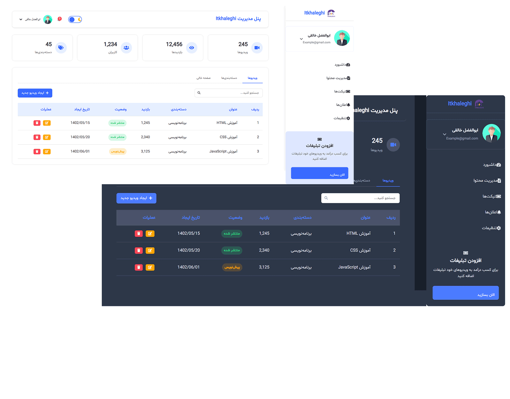

# پنل مدیریت Itkhaleghi

یک پنل مدیریت مدرن و واکنشگرا با طراحی فارسی (RTL) و پشتیبانی از حالت تاریک



## ویژگی‌های اصلی

- طراحی کاملاً واکنشگرا (Responsive)
- پشتیبانی از حالت تاریک و روشن
- منوی جمع‌شونده هوشمند
- سازگار با دستگاه‌های مختلف
- استفاده از فونت Shabnam برای نمایش بهتر فارسی
- ساختار تمیز و قابل توسعه

## صفحات موجود

1. **داشبورد** (`dashboard.html`) - صفحه اصلی با آمار و خلاصه اطلاعات
2. **مدیریت محتوا** (`content-management.html`) - مدیریت مقالات، ویدیوها و دسته‌بندی‌ها
3. **تیکت‌ها** (`tickets.html`) - سیستم پشتیبانی و مدیریت تیکت‌ها
4. **اعلان‌ها** (`notifications.html`) - نمایش و مدیریت اعلان‌های سیستم
5. **پروفایل کاربری** (`profile.html`) - مدیریت اطلاعات کاربر و تغییر رمز عبور
6. **تنظیمات** (`settings.html`) - تنظیمات سیستم و پشتیبان‌گیری
7. **ورود به سیستم** (`login.html`) - صفحه احراز هویت
8. **ثبت‌نام** (`register.html`) - صفحه ایجاد حساب کاربری
9. **صفحات خطا** (`404.html`, `403.html`) - صفحات خطای سفارشی

## راه‌اندازی

1. کلون کردن پروژه:
   ```bash
   git clone https://github.com/your-repo/admin-panel.git
   cd admin-panel

